# 常考图分类与详解

## 考试中一般怎么考

1. 图的归属：判断某个图是否属于 UML，属于结构图还是行为图，或属于 UML 之外的结构化分析、数据库建模、详细设计、项目管理图。
2. 图的选型：给出业务场景，要求判断应该画用例图、类图、顺序图、状态图、活动图、ER 图、DFD、流程图、盒图、PAD 图等。
3. 补图题：根据题干补参与者、用例、类关系、消息顺序、状态迁移、数据流、实体关系、判断分支等。
4. 图间转换：根据用例描述补顺序图，根据业务对象补类图或 ER 图，根据流程描述补活动图、流程图、PAD 图。
5. 易混辨析：区分类图和 ER 图、顺序图和通信图、活动图和流程图、状态图和活动图、DFD 和流程图、盒图和 PAD 图。

## 针对考法梳理知识点

### 总体包含关系

UML 图是一套面向对象建模图的集合，不等于所有软件工程图。ER 图、数据流图、流程图、盒图、PAD 图都不是 UML 图，但都可能在架构师考试中出现。

更完整的分类可以这样记：

```text
软件工程常考图
├── UML 图：面向对象建模图
│   ├── 结构图：描述系统静态结构，回答“系统有什么”
│   │   ├── 类图：类、属性、方法、类之间关系
│   │   ├── 对象图：某一时刻对象实例及其链接
│   │   ├── 包图：包、命名空间、包之间依赖
│   │   ├── 组件图：软件组件、接口、依赖关系
│   │   ├── 组合结构图：类或组件内部结构和协作
│   │   ├── 部署图：节点、运行环境、制品部署
│   │   └── 轮廓图 / Profile 图：扩展 UML 元模型，考试较少
│   └── 行为图：描述系统动态行为，回答“系统怎么动”
│       ├── 用例图：参与者和系统功能
│       ├── 活动图：业务流程、分支、并发、泳道
│       ├── 状态机图 / 状态图：对象状态及状态迁移
│       └── 交互图：对象之间如何协作
│           ├── 顺序图 / 序列图：按时间顺序的消息调用
│           ├── 通信图 / 协作图：对象连接关系和消息
│           ├── 定时图 / 时间图：状态或值随时间变化
│           └── 交互概览图：多个交互片段的控制流
├── 数据建模图：描述数据结构和数据关系
│   ├── ER 图 / E-R 图：实体、属性、联系
│   ├── 关系模式图：表、字段、主键、外键
│   └── 数据模型图：概念模型、逻辑模型、物理模型
├── 结构化分析与设计图：面向数据流和功能分解
│   ├── 数据流图 DFD：外部实体、加工、数据流、数据存储
│   │   ├── 上下文图 / 顶层图：系统和外部实体关系
│   │   └── 0 层图、1 层图：逐层分解处理过程
│   ├── 结构图 / 模块结构图 SC：模块层次、调用和数据传递
│   ├── HIPO 图：层次图加输入-处理-输出说明
│   └── IPO 图：输入、处理、输出
├── 详细设计和程序逻辑图：描述算法和控制结构
│   ├── 程序流程图：用箭头表示程序控制流
│   ├── N-S 图 / 盒图：用嵌套盒子表示顺序、选择、循环
│   ├── PAD 图：问题分析图，用树形结构表示程序逻辑
│   ├── 判定表：多条件组合下的动作选择
│   ├── 判定树：用树形分支表示条件判断和结果
│   ├── 控制流图：测试中分析控制路径和圈复杂度
│   └── 伪代码 / PDL：不是图，但常和详细设计一起考
├── 业务流程和通用表达图：描述业务步骤或组织协作
│   ├── 流程图：通用流程步骤
│   ├── 泳道图：按角色、部门或系统划分责任
│   ├── BPMN 图：标准化业务流程建模
│   └── 组织结构图：组织、岗位、上下级关系
├── 架构、部署和集成类图：描述系统整体关系
│   ├── 架构图：非严格标准，描述系统模块、层次、依赖
│   ├── 系统上下文图：系统和外部用户、外部系统关系
│   ├── C4 模型图：上下文、容器、组件、代码层级
│   ├── 网络拓扑图：节点、网络、链路、防火墙等
│   └── 接口关系图：系统间接口、调用方向、协议
└── 项目管理和过程图
    ├── 甘特图：任务计划、持续时间、进度
    ├── PERT 图 / 网络图：任务依赖、关键路径
    ├── 里程碑图：关键节点和交付物
    └── 燃尽图：敏捷迭代中剩余工作量变化
```

考试中最重要的边界：

- 类图、对象图、包图、组件图、部署图、用例图、活动图、状态图、顺序图都属于 UML。
- ER 图属于数据建模，不属于 UML。
- DFD、结构图、HIPO、IPO 属于结构化分析与设计，不属于 UML。
- 流程图、N-S 图、盒图、PAD 图属于流程或详细设计表达，不属于 UML。
- 甘特图、PERT 图属于项目管理，不属于 UML。

### UML 图总体分类

UML 图分两大类：结构图和行为图。

结构图描述静态结构，重点是“系统由哪些元素组成、元素之间是什么关系”。典型图是类图、组件图、部署图。

行为图描述动态行为，重点是“系统如何交互、流程如何推进、状态如何变化”。典型图是用例图、活动图、状态图、顺序图。

交互图是行为图的子类，专门描述对象之间的协作。顺序图、通信图、定时图、交互概览图都属于交互图。

### 类图

类图属于 UML 结构图，用于描述类、属性、方法以及类之间的静态关系。

常见元素：

- 类：通常分为类名、属性、方法三栏。
- 关联：一个类知道或使用另一个类。
- 聚合：弱整体-部分，部分可以脱离整体存在。
- 组合：强整体-部分，部分生命周期依赖整体。
- 泛化：继承关系。
- 实现：类实现接口。
- 依赖：临时使用关系。

常考点：

- 识别业务名词中的候选类。
- 判断类之间是关联、聚合、组合、继承还是实现。
- 补多重度，例如 `1`、`0..1`、`1..*`、`*`。
- 根据题干补属性和方法。

易混点：

- 类图偏面向对象设计，ER 图偏数据库设计。
- 组合比聚合更强，关键看部分对象能否脱离整体独立存在。
- 继承表示“是一种”，聚合/组合表示“有一个或有多个”。

### 对象图

对象图属于 UML 结构图，是类图在某一时刻的实例快照。

它描述具体对象及对象之间的链接。例如 `张三:用户`、`订单001:订单`、`商品A:商品` 之间的关系。

常考点较少，通常用于说明类图实例化后的结构。

易混点：

- 类图描述类型和规则，比较抽象。
- 对象图描述具体对象和具体链接，强调某一时刻。

### 包图

包图属于 UML 结构图，用于描述包、命名空间、子系统之间的组织和依赖关系。

它适合表达大系统的分层、模块划分和依赖方向，例如表示层包、业务层包、数据访问层包之间的依赖。

常考点：

- 判断模块或包之间是否存在不合理依赖。
- 分析循环依赖、跨层调用等可维护性问题。
- 表达分层架构的包组织。

易混点：包图关注逻辑组织和依赖，组件图关注可替换、可部署的软件组件。

### 组件图

组件图属于 UML 结构图，用于描述软件组件、接口以及组件之间的依赖关系。

常见元素：

- 组件：可替换的软件单元，例如订单服务、支付组件、报表组件。
- 提供接口：组件对外提供的能力。
- 需要接口：组件依赖外部提供的能力。
- 依赖关系：组件调用或使用其他组件。

常考点：

- 根据系统模块补组件。
- 判断组件之间的依赖方向。
- 分析组件解耦、接口隔离和复用。

易混点：

- 类图更细，关注类和对象模型。
- 组件图更粗，关注软件构件和接口。
- 部署图关注组件部署到哪些节点上。

### 组合结构图

组合结构图属于 UML 结构图，用于描述类或组件的内部结构，以及内部部件之间如何协作。

它比类图更强调“一个结构内部由哪些部件组成、通过哪些端口协作”。

架构师考试中出现频率不高，知道它属于 UML 结构图即可。

易混点：组合结构图关注内部结构，组件图关注组件之间的外部依赖。

### 部署图

部署图属于 UML 结构图，用于描述软件制品部署到哪些硬件节点或运行环境上。

常见元素：

- 节点：服务器、客户端、容器、虚拟机、数据库服务器等。
- 制品：可执行程序、服务包、配置文件、数据库脚本等。
- 通信路径：节点之间的网络连接。

常考点：

- 根据系统架构补 Web 服务器、应用服务器、数据库服务器、缓存服务器。
- 判断部署是否存在单点。
- 分析负载均衡、主备、集群和网络连接。

易混点：

- 组件图是软件逻辑结构。
- 部署图是运行时物理或环境结构。
- 一个组件可以部署到一个或多个节点上。

### 轮廓图 / Profile 图

轮廓图属于 UML 结构图，用于扩展 UML 元模型，定义特定领域的构造型、标记值和约束。

考试中很少深入考。一般只需要知道它属于 UML 结构图，不是常规业务建模图。

### 用例图

用例图属于 UML 行为图，用于描述系统边界、参与者和系统提供的功能。

常见元素：

- 参与者：系统外部与系统交互的人、组织或外部系统。
- 用例：系统为参与者提供的目标性功能。
- 系统边界：区分系统内外。
- 关系：关联、包含、扩展、泛化。

常考点：

- 根据题干找参与者。
- 判断哪些功能应该作为用例。
- 区分 `include` 和 `extend`。
- 避免把系统内部模块画成参与者。

易混点：

- 用例图描述“谁使用系统做什么”，不描述内部处理步骤。
- 公共必经步骤用包含，可选或异常行为用扩展。

### 活动图

活动图属于 UML 行为图，用于描述业务流程、控制流、分支、并发和责任分工。

常见元素：

- 初始节点和终止节点。
- 活动。
- 判断和合并。
- 分叉和汇合。
- 泳道。

常考点：

- 根据业务流程补活动顺序。
- 补判断条件和分支。
- 用泳道表示不同角色、部门或系统的责任。
- 表示并发处理。

易混点：

- 活动图和流程图都描述流程，但活动图是 UML 标准图，表达能力更规范。
- 活动图描述流程，不适合表达类之间的静态关系。
- 如果题目强调对象状态变化，优先状态图。

### 状态机图 / 状态图

状态图属于 UML 行为图，用于描述一个对象在生命周期中的状态以及状态迁移。

常见元素：

- 状态：待支付、已支付、已发货、已取消等。
- 事件：支付成功、超时未支付、取消订单。
- 迁移：从一个状态到另一个状态。
- 初始状态和终止状态。

常考点：

- 根据题干补状态。
- 补触发状态迁移的事件。
- 判断某状态能否直接迁移到另一个状态。

易混点：

- 状态图关注“一个对象的状态变化”。
- 活动图关注“业务流程步骤”。
- 顺序图关注“多个对象之间的调用顺序”。

### 顺序图 / 序列图

顺序图属于 UML 交互图，用于描述对象之间按时间顺序发送消息的过程。

注意：国内资料中“时序图”很多时候指顺序图；UML 标准里还存在 Timing Diagram，通常译为定时图或时间图。

常见元素：

- 参与对象或生命线。
- 激活条。
- 同步消息、异步消息、返回消息。
- 条件片段、循环片段。

常考点：

- 根据业务流程补对象和消息。
- 判断调用先后顺序。
- 补返回结果、条件分支和循环。
- 分析外部接口调用和异常处理。

易混点：

- 顺序图强调时间顺序。
- 通信图强调对象之间的连接关系。
- 活动图强调业务流程，不强调对象间消息。

### 通信图 / 协作图

通信图属于 UML 交互图，用于描述对象之间的链接关系以及在这些链接上传递的消息。

它和顺序图表达的信息相近，但关注点不同：

- 顺序图更清楚地表现时间顺序。
- 通信图更清楚地表现对象之间的结构关系。

常考点：出现频率低于顺序图，通常考识别或与顺序图区分。

### 活动图、顺序图、通信图同场景对比

下面用同一个“用户下单”场景画三张图。三张图表达的是同一件事，但观察角度不同：

- 活动图：看业务流程怎么走。
- 顺序图：看对象之间按什么时间顺序调用。
- 通信图：看哪些对象参与协作，以及对象之间怎么连接。

#### 活动图：流程视角

活动图不重点关心“订单服务调用库存服务”这种对象消息，而是关心业务步骤、分支和流程走向。

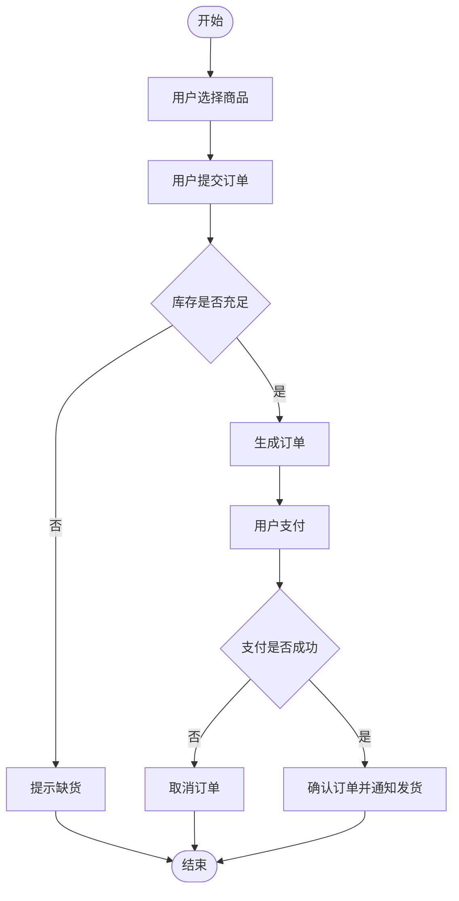

读图方法：

- 从开始节点沿箭头看流程。
- 菱形表示判断分支。
- 关注“先做什么、后做什么、有哪些分支”。
- 如果加泳道，还可以看每一步由哪个角色、部门或系统负责。

#### 顺序图：调用顺序视角

顺序图把参与对象横向排开，时间从上往下推进。它最适合看“谁先调用谁，谁后调用谁”。

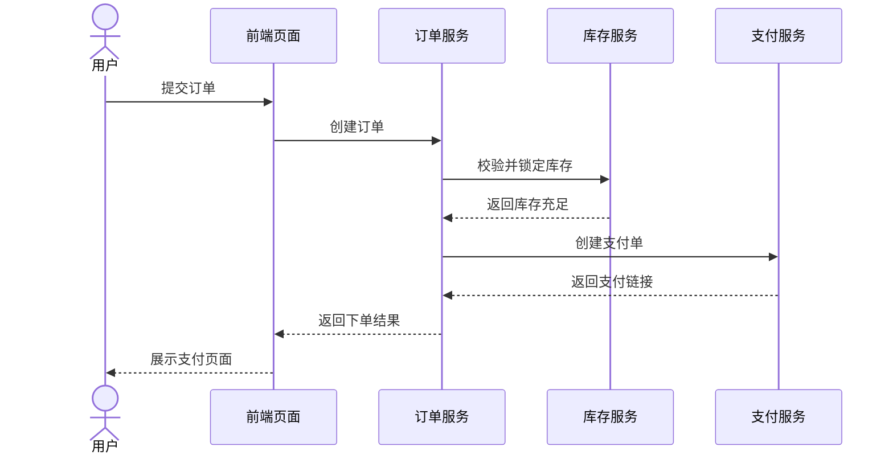

读图方法：

- 横向看有哪些对象或系统参与。
- 纵向从上往下看时间顺序。
- 实线消息通常表示调用，虚线消息通常表示返回。
- 关注调用链是否完整，是否漏掉外部系统、返回结果或异常分支。

#### 通信图：对象协作视角

通信图也描述对象交互，但它不把时间画成从上到下的生命线，而是把对象之间的连接关系画出来，再用消息编号表示顺序。

这里用 Mermaid 的关系图近似表达 UML 通信图：

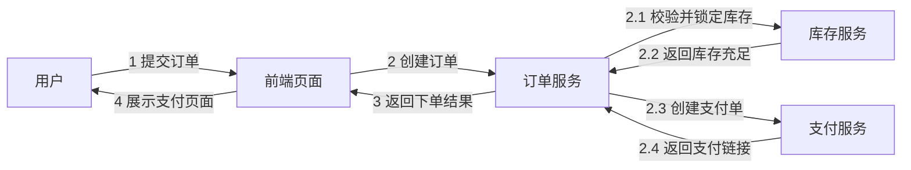

读图方法：

- 先看有哪些对象参与协作。
- 再看对象之间有哪些连接。
- 最后看消息编号，编号表示调用顺序。
- 它比顺序图更突出“对象之间的关系网”，但时间顺序不如顺序图直观。

三者最短区分：

| 图 | 看什么 | 关键词 |
| --- | --- | --- |
| 活动图 | 流程怎么走 | 步骤、分支、并发、泳道 |
| 顺序图 | 调用怎么排 | 生命线、消息、返回、时间顺序 |
| 通信图 | 对象怎么连 | 对象链接、协作、消息编号 |

### 定时图 / 时间图

定时图属于 UML 交互图，用于描述对象状态或属性值随时间变化的情况。

它适合实时系统、嵌入式系统、通信协议等需要关注时间约束的场景。

易混点：

- 定时图强调时间轴上的状态变化。
- 顺序图强调对象之间消息调用顺序。
- 国内说“时序图”时，多数题目实际指顺序图，需要结合题干判断。

### 交互概览图

交互概览图属于 UML 交互图，用于把多个交互片段组合起来，描述更高层次的控制流。

它可以理解为活动图和交互图的结合：用流程控制结构组织多个顺序图或交互片段。

考试中较少深入考，知道它属于 UML 交互图即可。

### ER 图 / E-R 图

ER 图属于数据建模图，不属于 UML。它用于描述实体、属性和实体之间的联系。

常见元素：

- 实体：用户、订单、商品、课程。
- 属性：用户名、订单号、价格。
- 联系：下单、选课、属于。
- 基数：一对一、一对多、多对多。

常考点：

- 从业务描述中抽取实体。
- 判断实体之间是一对一、一对多还是多对多。
- 多对多关系通常需要转换为中间表。
- 根据 ER 图转换关系模式。

易混点：

- ER 图偏数据库概念模型。
- 类图偏面向对象设计模型。
- ER 图中的联系不等于 UML 类图中的所有关系。

### 关系模式图

关系模式图用于描述数据库表结构、字段、主键、外键和表之间的引用关系。

它比 ER 图更接近数据库逻辑设计。

常考点：

- 根据 ER 图转换关系模式。
- 标出主键和外键。
- 处理多对多关系的中间表。
- 判断是否存在冗余和范式问题。

易混点：ER 图偏概念层，关系模式偏逻辑表结构。

### 数据模型图

数据模型图是泛称，可包括概念模型、逻辑模型、物理模型。

常见层次：

- 概念模型：关注业务实体和关系，不关心具体数据库实现。
- 逻辑模型：转换为表、字段、主键、外键。
- 物理模型：考虑索引、分区、存储、字段类型和约束。

考试中如果问“数据库设计阶段”，常按概念设计、逻辑设计、物理设计来回答。

### 数据流图 DFD

数据流图属于结构化分析图，不属于 UML。它用于描述数据从哪里来、经过哪些处理、存到哪里、输出到哪里。

常见元素：

- 外部实体：系统外部的数据来源或去向。
- 加工 / 处理：对数据进行处理的过程。
- 数据流：数据的流动方向。
- 数据存储：文件、数据库、台账等。

常考点：

- 补外部实体、数据流、加工和数据存储。
- 判断父图和子图是否平衡。
- 区分数据流和控制流。

易混点：

- DFD 关注数据流，不强调处理顺序和控制条件。
- 流程图关注控制流程和步骤顺序。
- 用例图关注系统功能目标，不关注数据怎么流。

下面仍用“用户下单”场景画 DFD。注意图里箭头名称是数据，例如“订单提交信息”“库存数据”“支付结果”，不是方法调用。

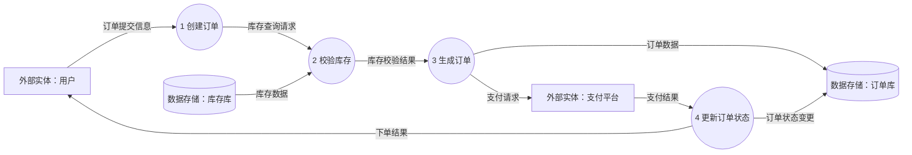

读图方法：

- 方框是外部实体，表示系统外部的数据来源或去向。
- 圆形或圆角处理是加工，表示系统内部对数据做处理。
- 数据库存储符号表示数据存储，表示订单库、库存库等。
- 箭头必须有数据名，表示数据从哪里流到哪里。

这张 DFD 和前面的活动图、顺序图区别很明显：

| 图 | 这张图主要看什么 | 箭头通常表示 |
| --- | --- | --- |
| 活动图 | 业务步骤和分支怎么走 | 控制流、流程先后 |
| 顺序图 | 对象之间谁先调用谁 | 调用消息和返回消息 |
| DFD | 数据从哪里来、到哪里去、被谁处理、存到哪里 | 数据流 |

DFD 画图规则：

- 外部实体不能直接连外部实体，中间应经过系统加工。
- 外部实体不能直接连数据存储，中间应经过加工。
- 数据存储不能主动处理数据，必须由加工读写。
- 加工最好用动宾短语命名，例如“校验库存”“生成订单”。
- 数据流要命名，不能只画无名称箭头。

### 上下文图 / 顶层图

上下文图是最高层的数据流图，把整个系统看成一个加工，重点描述系统与外部实体之间的数据交换。

常考点：

- 找系统边界。
- 找外部实体。
- 找输入输出数据流。

易混点：上下文图不是用例图。上下文图关注数据输入输出，用例图关注参与者和功能目标。

### 0 层图和 1 层图

0 层图把上下文图中的系统进一步分解为几个主要加工。

1 层图继续对 0 层图中的某个加工进行细化。

常考点：

- 父图和子图平衡：进入父加工的数据流，在子图中也应能对应。
- 分解不能凭空增加或丢失关键输入输出。

### 结构图 / 模块结构图 SC

结构图属于结构化设计图，用于描述模块层次、模块调用关系以及模块之间传递的数据或控制信息。

常见元素：

- 模块。
- 调用关系。
- 数据传递。
- 控制传递。

常考点：

- 根据 DFD 转换模块结构图。
- 分析模块独立性、耦合和内聚。
- 判断上层模块调用下层模块的层次关系。

易混点：

- 结构图不是 UML 结构图里的“结构图”概念。
- 结构化设计中的结构图强调模块调用层次，不是类图。

### HIPO 图

HIPO 是 Hierarchy plus Input-Process-Output，表示“层次图 + 输入处理输出图”。

它用于自顶向下描述系统功能分解，并说明每个模块的输入、处理和输出。

常考点：

- 层次图表达功能分解。
- IPO 图说明具体模块的数据输入、处理逻辑和输出。

易混点：HIPO 比单纯 IPO 多了层次分解。

### IPO 图

IPO 图描述输入、处理、输出。

它适合说明一个模块、功能或处理过程：输入什么数据，经过什么处理，输出什么结果。

常考点：

- 根据功能描述补输入、处理、输出。
- 和 HIPO 结合用于结构化设计。

### 程序流程图

程序流程图用于描述程序控制流程，常用开始/结束、处理、判断、输入输出、箭头等符号。

常考点：

- 根据算法补流程。
- 判断分支和循环。
- 分析流程路径。

优点是直观，缺点是容易画出复杂跳转，不利于结构化设计。

易混点：程序流程图偏程序逻辑，业务流程图偏业务过程。

### N-S 图 / 盒图

N-S 图也叫盒图，用嵌套矩形表示结构化程序的三种基本控制结构：顺序、选择、循环。

特点：

- 没有随意跳转箭头。
- 强制结构化表达。
- 适合详细设计阶段描述算法逻辑。

常考点：

- 判断顺序、选择、循环结构。
- 将流程图转换为盒图。
- 说明盒图为什么有利于结构化程序设计。

易混点：盒图不是 UML，也不是普通流程图。它更强调结构化控制结构。

### PAD 图

PAD 图是 Problem Analysis Diagram，问题分析图，用树形结构描述程序逻辑。

它可以表达：

- 顺序结构。
- 选择结构。
- 循环结构。
- 多分支结构。

常考点：

- 根据算法逻辑补 PAD 图。
- 和程序流程图、盒图区分。
- 用于详细设计阶段。

易混点：PAD 图和盒图都用于结构化程序逻辑表达，但 PAD 更像树形展开，盒图更像嵌套矩形。

### 判定表

判定表用于描述多个条件组合下应该执行哪些动作。

它适合条件多、组合复杂、规则明确的业务，例如审批规则、折扣规则、权限规则。

常见组成：

- 条件项。
- 条件取值。
- 动作项。
- 动作执行情况。

常考点：

- 根据业务规则补条件组合和动作。
- 判断是否遗漏组合。
- 合并无关条件，简化判定表。

易混点：判定表适合多条件组合，流程图适合顺序流程。

### 判定树

判定树用树形分支表达条件判断和最终动作。

它适合把一组条件判断按层次展开，直观展示从根到叶的判断过程。

常考点：

- 根据判定表转换判定树。
- 根据业务规则补分支和叶子动作。

易混点：

- 判定树更直观，但条件组合多时可能变得很大。
- 判定表更适合系统化检查组合是否完整。

### 控制流图

控制流图用于表示程序的控制路径，常用于白盒测试、路径覆盖和圈复杂度计算。

常见元素：

- 节点：语句块或判断。
- 边：控制流转移。

常考点：

- 计算圈复杂度。
- 推导独立路径集合。
- 设计基本路径测试用例。

易混点：控制流图是测试分析工具，不是业务流程建模图。

### 伪代码 / PDL

伪代码或 PDL 不是图，但常和详细设计一起考，用接近自然语言和程序结构的方式描述算法。

它适合表达复杂逻辑，又不受具体编程语言语法限制。

常考点：

- 根据流程图、PAD 图写伪代码。
- 根据伪代码补流程或判断逻辑。

### 流程图

流程图是通用流程表达图，可以描述业务流程，也可以描述程序流程。

常见元素：

- 开始和结束。
- 处理步骤。
- 判断分支。
- 输入输出。
- 箭头。

常考点：

- 根据题干补步骤和分支。
- 判断流程是否缺少异常路径。
- 和活动图、PAD 图、盒图区分。

易混点：

- 普通流程图不属于 UML。
- 活动图属于 UML，适合表达业务流程、并发和泳道。
- 程序流程图偏算法控制流。

### 泳道图

泳道图按角色、部门、岗位或系统划分责任区域，在每个泳道中放置对应活动。

它可以作为活动图的一种表现方式，也常作为业务流程图使用。

常考点：

- 判断每个步骤由谁负责。
- 识别跨部门或跨系统协作。
- 找出责任不清或流程断点。

易混点：泳道强调责任归属，不只是流程先后顺序。

### BPMN 图

BPMN 是业务流程建模与标注，用于标准化描述业务流程。

常见元素：

- 事件。
- 活动。
- 网关。
- 顺序流。
- 消息流。
- 池和泳道。

架构师案例分析中不一定深入考符号，但可能出现流程建模概念。知道它偏业务流程管理和流程协同即可。

### 组织结构图

组织结构图用于描述组织、部门、岗位和上下级关系。

它不属于 UML，通常用于管理、业务分析和职责划分。

常考点较少，可能用于理解参与者、部门职责或流程责任。

### 架构图

架构图是非严格标准图，通常用于表达系统的层次、模块、服务、组件、数据存储、中间件和外部系统关系。

它可以有多种画法，例如分层架构图、微服务架构图、部署架构图、数据架构图。

常考点：

- 识别单点和瓶颈。
- 判断模块职责和依赖方向。
- 分析质量属性影响。
- 给出改进方案。

易混点：架构图不是 UML 的固定图种，具体含义要看图例和题干。

### 系统上下文图

系统上下文图描述目标系统与外部用户、外部系统、外部设备之间的关系。

它回答“系统处在什么环境中，和谁交互”。

常考点：

- 确定系统边界。
- 识别外部参与者和外部系统。
- 分析接口和数据交换。

易混点：

- 系统上下文图偏架构和边界。
- DFD 上下文图偏数据输入输出。
- 用例图偏参与者使用系统功能。

### C4 模型图

C4 模型是一种架构表达方法，分为四个层次：

- Context：系统上下文，说明系统和外部对象关系。
- Container：容器，说明应用、数据库、前端、服务等运行单元。
- Component：组件，说明容器内部组件。
- Code：代码，接近类或代码结构。

常考点不高，但它有助于理解架构图层次。答题时不要把 C4 当 UML，它是架构可视化方法。

### 网络拓扑图

网络拓扑图描述网络节点、链路、交换机、路由器、防火墙、负载均衡、服务器和安全区域。

常考点：

- 分析网络连通性。
- 判断安全边界和防火墙位置。
- 识别单点链路。
- 说明内外网隔离、DMZ、VPN 等。

易混点：网络拓扑图关注网络连接和安全域，部署图关注软件制品部署到运行节点上。

### 接口关系图

接口关系图描述系统之间的接口、调用方向、协议、数据格式和依赖关系。

常考点：

- 判断同步调用还是异步消息。
- 分析接口调用链过长的问题。
- 识别外部依赖风险。
- 补认证、签名、限流、超时、重试等接口治理措施。

### 甘特图

甘特图属于项目管理图，用横向时间条表示任务计划、开始结束时间、持续时间和进度。

常考点：

- 看任务排期。
- 判断任务是否延期。
- 识别并行任务和里程碑。

易混点：甘特图直观展示时间计划，但不擅长分析复杂依赖和关键路径。

### PERT 图 / 网络图

PERT 图或网络图用于描述任务之间的依赖关系，并分析关键路径。

常考点：

- 计算最早开始、最早完成、最迟开始、最迟完成。
- 计算总时差和自由时差。
- 找关键路径。
- 判断某任务延期是否影响总工期。

易混点：PERT 图重依赖和关键路径，甘特图重时间计划展示。

### 里程碑图

里程碑图用于表示项目中的关键节点和重要交付物，例如需求评审完成、设计基线建立、系统上线。

它关注关键时间点，不详细展示所有任务持续时间。

### 燃尽图

燃尽图常用于敏捷项目，表示迭代中剩余工作量随时间变化。

常考点：

- 判断团队进度是否偏离计划。
- 观察剩余工作量下降趋势。
- 辅助发现估算偏差或阻塞。

### 各类图示例

下面把文档中“能画出来”的图集中画一遍。Mermaid 没有原生支持的图，例如用例图、盒图、PAD 图、BPMN 图，这里用近似画法表达考试关注点。

#### 类图示例

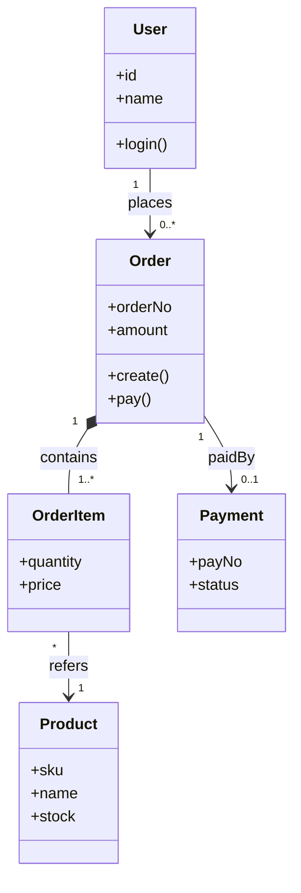

#### 对象图示例

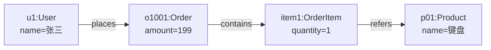

#### 包图示例

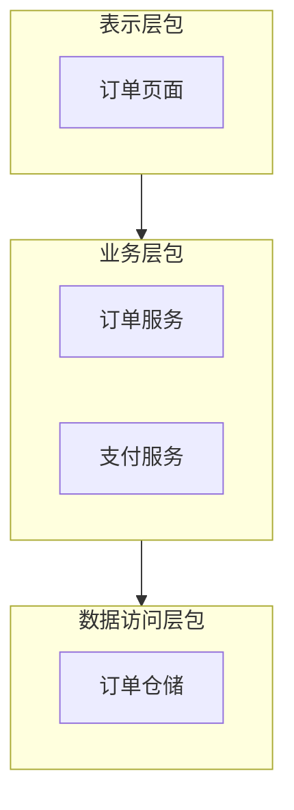

#### 组件图示例

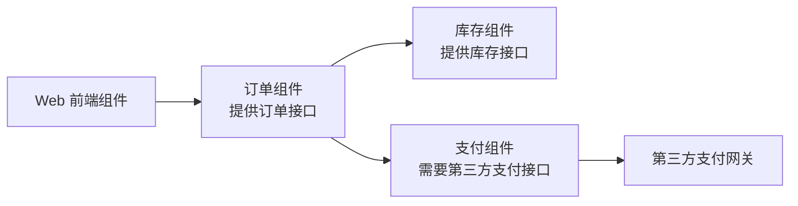

#### 组合结构图示例

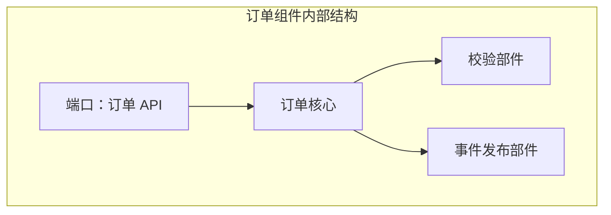

#### 部署图示例

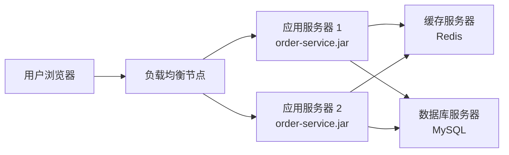

#### 用例图示例

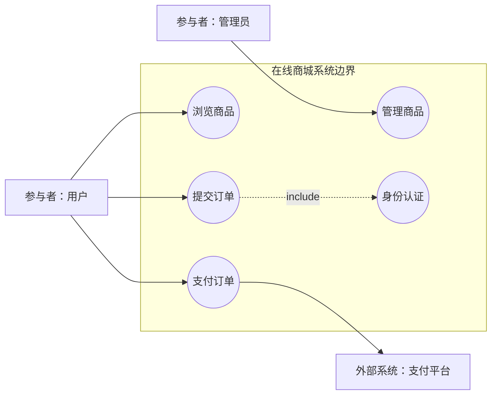

#### 活动图示例

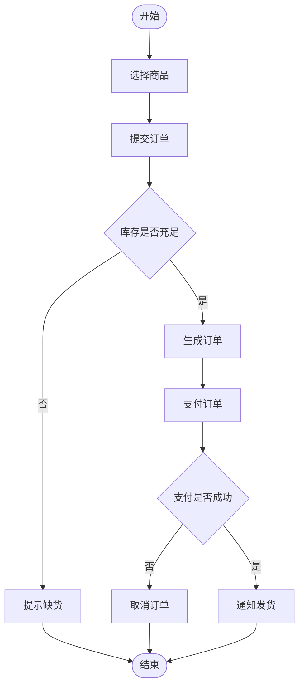

#### 状态图示例

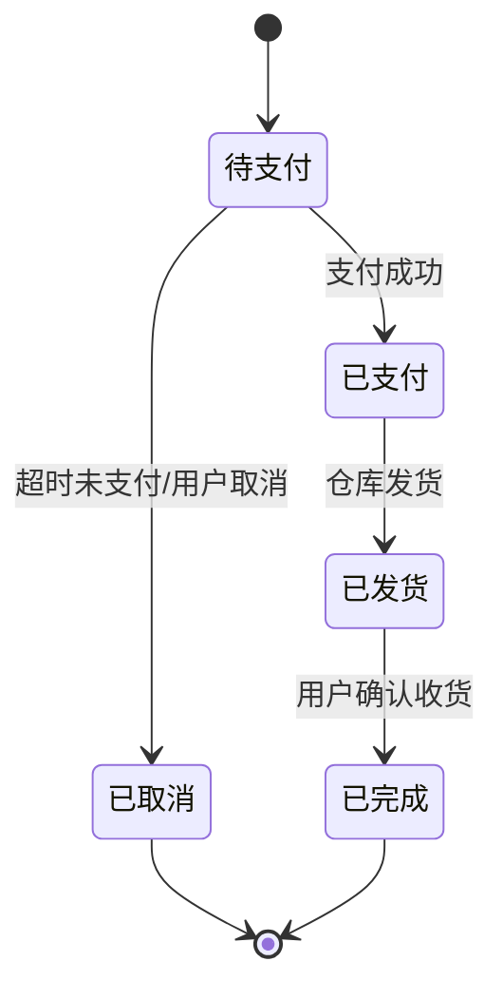

#### 顺序图示例

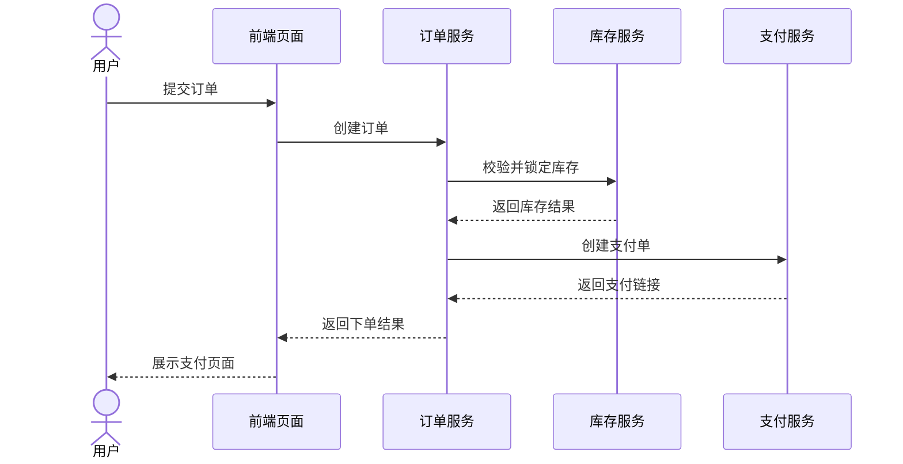

#### 通信图示例

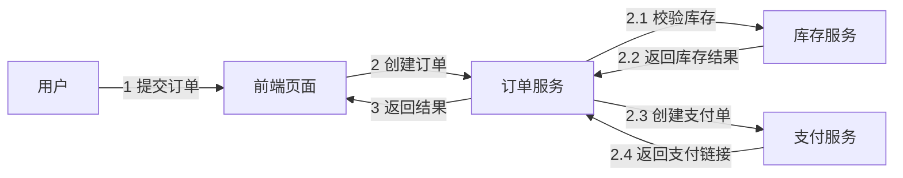

#### 定时图示例

Mermaid 没有稳定通用的定时图语法，这里用时间轴近似表达“状态随时间变化”。

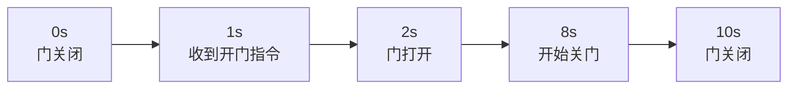

#### 交互概览图示例

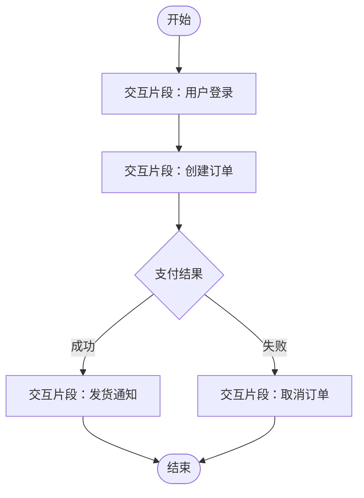

#### ER 图示例

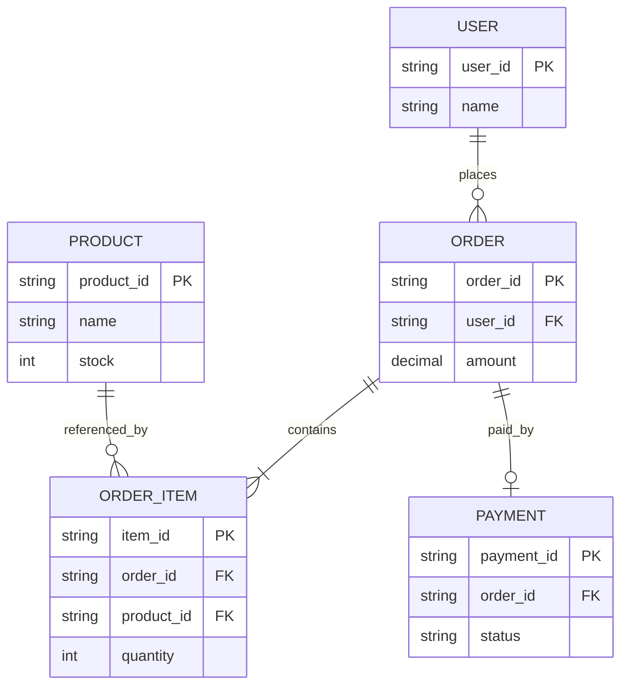

#### 关系模式图示例

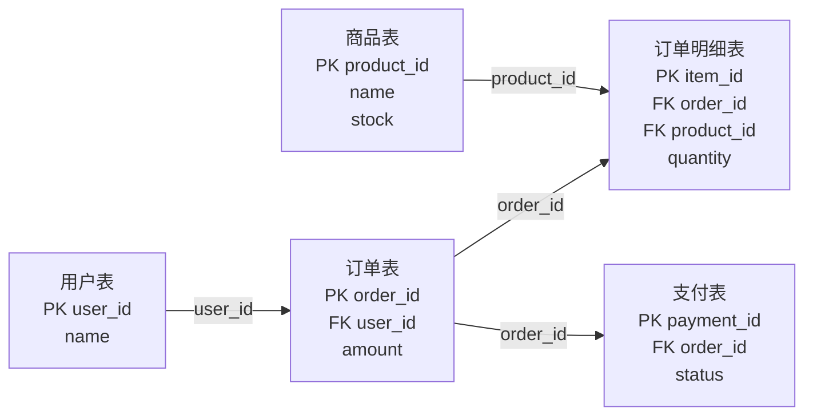

#### 数据模型图示例

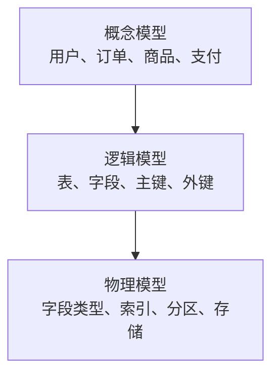

#### 数据流图 DFD 示例

```mermaid
flowchart LR
    U["外部实体：用户"]
    Pay["外部实体：支付平台"]
    P1(("1 创建订单"))
    P2(("2 校验库存"))
    P3(("3 生成订单"))
    P4(("4 更新订单状态"))
    D1[("数据存储：库存库")]
    D2[("数据存储：订单库")]
    U -- "订单提交信息" --> P1
    P1 -- "库存查询请求" --> P2
    D1 -- "库存数据" --> P2
    P2 -- "库存校验结果" --> P3
    P3 -- "订单数据" --> D2
    P3 -- "支付请求" --> Pay
    Pay -- "支付结果" --> P4
    P4 -- "订单状态变更" --> D2
    P4 -- "下单结果" --> U
```

#### 上下文图 / 顶层图示例

```mermaid
flowchart LR
    User["用户"]
    Admin["管理员"]
    Pay["支付平台"]
    System(("在线商城系统"))
    User -- "订单信息/查询请求" --> System
    System -- "下单结果/订单状态" --> User
    Admin -- "商品维护信息" --> System
    System -- "支付请求" --> Pay
    Pay -- "支付结果" --> System
```

#### 0 层图示例

```mermaid
flowchart LR
    User["用户"]
    P1(("1 商品查询"))
    P2(("2 订单处理"))
    P3(("3 支付处理"))
    D1[("商品库")]
    D2[("订单库")]
    Pay["支付平台"]
    User -- "查询条件" --> P1
    P1 -- "商品数据" --> D1
    D1 -- "商品列表" --> P1
    P1 -- "商品结果" --> User
    User -- "订单信息" --> P2
    P2 -- "订单数据" --> D2
    P2 -- "支付请求" --> P3
    P3 --> Pay
    Pay -- "支付结果" --> P3
    P3 -- "支付状态" --> D2
```

#### 结构图 / 模块结构图示例

```mermaid
flowchart TD
    M0["订单管理模块"]
    M1["接收订单模块"]
    M2["校验库存模块"]
    M3["生成订单模块"]
    M4["支付处理模块"]
    M5["通知模块"]
    M0 --> M1
    M0 --> M2
    M0 --> M3
    M0 --> M4
    M0 --> M5
```

#### HIPO 图示例

```mermaid
flowchart TD
    H["订单处理系统"]
    H1["1 接收输入<br/>输入：订单信息"]
    H2["2 处理订单<br/>处理：校验库存、计算金额"]
    H3["3 输出结果<br/>输出：订单状态、支付链接"]
    H --> H1 --> H2 --> H3
```

#### IPO 图示例

```mermaid
flowchart LR
    I["输入<br/>订单信息<br/>用户信息<br/>商品信息"]
    P["处理<br/>校验库存<br/>计算金额<br/>生成订单"]
    O["输出<br/>订单号<br/>支付链接<br/>下单结果"]
    I --> P --> O
```

#### 程序流程图示例

```mermaid
flowchart TD
    A(["开始"]) --> B["读取订单信息"]
    B --> C{"库存是否充足"}
    C -- "否" --> D["返回缺货"]
    C -- "是" --> E["生成订单"]
    E --> F["返回订单号"]
    D --> Z(["结束"])
    F --> Z
```

#### N-S 图 / 盒图示例

Mermaid 没有盒图专用语法，这里用嵌套块近似表示顺序、选择、循环结构。

```mermaid
flowchart TD
    subgraph NS["N-S 图 / 盒图示意"]
        A["读取订单信息"]
        subgraph IF["选择结构：库存是否充足"]
            B1["是：生成订单"]
            B2["否：返回缺货"]
        end
        C["输出处理结果"]
    end
    A --> IF --> C
```

#### PAD 图示例

```mermaid
flowchart TD
    Root["处理订单"]
    Root --> A["读取订单信息"]
    Root --> B{"库存是否充足"}
    B -- "是" --> C["生成订单"]
    B -- "否" --> D["返回缺货"]
    Root --> E["输出处理结果"]
```

#### 判定表示例

| 条件 / 动作 | 规则 1 | 规则 2 | 规则 3 | 规则 4 |
| --- | --- | --- | --- | --- |
| 库存充足 | 是 | 是 | 否 | 否 |
| 用户已登录 | 是 | 否 | 是 | 否 |
| 生成订单 | 是 | 否 | 否 | 否 |
| 提示登录 | 否 | 是 | 否 | 是 |
| 提示缺货 | 否 | 否 | 是 | 否 |

#### 判定树示例

```mermaid
flowchart TD
    A{"用户已登录"}
    A -- "否" --> B["提示登录"]
    A -- "是" --> C{"库存充足"}
    C -- "否" --> D["提示缺货"]
    C -- "是" --> E["生成订单"]
```

#### 控制流图示例

```mermaid
flowchart TD
    N1["1 开始"]
    N2["2 读取订单"]
    N3{"3 判断库存"}
    N4["4 生成订单"]
    N5["5 返回缺货"]
    N6["6 结束"]
    N1 --> N2 --> N3
    N3 -- "是" --> N4 --> N6
    N3 -- "否" --> N5 --> N6
```

#### 流程图示例

```mermaid
flowchart TD
    A(["开始"]) --> B["填写申请"]
    B --> C["提交审批"]
    C --> D{"审批通过"}
    D -- "否" --> E["退回修改"]
    E --> B
    D -- "是" --> F["归档"]
    F --> Z(["结束"])
```

#### 泳道图示例

Mermaid 没有泳道图专用语法，这里用子图近似表示不同角色的泳道。

```mermaid
flowchart LR
    subgraph UserLane["用户"]
        A["提交订单"]
        H["查看结果"]
    end
    subgraph SystemLane["系统"]
        B["校验库存"]
        C["生成订单"]
    end
    subgraph PayLane["支付平台"]
        D["完成支付"]
    end
    A --> B --> C --> D --> H
```

#### BPMN 图示例

Mermaid 没有 BPMN 专用语法，这里用流程图近似表达事件、任务和网关。

```mermaid
flowchart TD
    Start(("开始事件"))
    Task1["任务：提交订单"]
    Gate{"网关：库存充足？"}
    Task2["任务：支付订单"]
    Task3["任务：提示缺货"]
    End(("结束事件"))
    Start --> Task1 --> Gate
    Gate -- "是" --> Task2 --> End
    Gate -- "否" --> Task3 --> End
```

#### 组织结构图示例

```mermaid
flowchart TD
    CEO["项目负责人"]
    BA["需求分析组"]
    DEV["开发组"]
    TEST["测试组"]
    OPS["运维组"]
    CEO --> BA
    CEO --> DEV
    CEO --> TEST
    CEO --> OPS
```

#### 架构图示例

```mermaid
flowchart LR
    Client["客户端"]
    Gateway["API 网关"]
    Order["订单服务"]
    Stock["库存服务"]
    Pay["支付服务"]
    MQ["消息队列"]
    DB["业务数据库"]
    Redis["Redis 缓存"]
    Client --> Gateway
    Gateway --> Order
    Order --> Stock
    Order --> Pay
    Order --> MQ
    Order --> DB
    Order --> Redis
```

#### 系统上下文图示例

```mermaid
flowchart LR
    User["用户"]
    Admin["运营人员"]
    System["在线商城系统"]
    Pay["支付平台"]
    WMS["仓储系统"]
    User --> System
    Admin --> System
    System --> Pay
    System --> WMS
```

#### C4 模型图示例

```mermaid
flowchart TD
    C1["Context<br/>用户使用在线商城下单"]
    C2["Container<br/>Web 前端、订单服务、数据库"]
    C3["Component<br/>订单控制器、订单应用服务、订单仓储"]
    C4["Code<br/>Order、OrderItem、OrderRepository"]
    C1 --> C2 --> C3 --> C4
```

#### 网络拓扑图示例

```mermaid
flowchart LR
    Internet["互联网"]
    FW["防火墙"]
    LB["负载均衡"]
    Web["Web 区"]
    App["应用区"]
    DB["数据库区"]
    Internet --> FW --> LB --> Web --> App --> DB
```

#### 接口关系图示例

```mermaid
flowchart LR
    App["移动端"]
    Gateway["API 网关"]
    Order["订单服务"]
    Pay["支付平台"]
    SMS["短信服务"]
    App -- "HTTPS/JSON" --> Gateway
    Gateway -- "REST" --> Order
    Order -- "HTTPS 签名接口" --> Pay
    Order -- "异步消息" --> SMS
```

#### 甘特图示例

```mermaid
gantt
    title 项目计划
    dateFormat  YYYY-MM-DD
    section 需求
    需求调研      :a1, 2026-05-01, 5d
    需求评审      :a2, after a1, 2d
    section 开发
    架构设计      :b1, after a2, 4d
    编码实现      :b2, after b1, 8d
    section 测试
    系统测试      :c1, after b2, 5d
    上线准备      :c2, after c1, 2d
```

#### PERT 图 / 网络图示例

```mermaid
flowchart LR
    A["A 需求分析<br/>3天"]
    B["B 架构设计<br/>4天"]
    C["C 数据库设计<br/>2天"]
    D["D 编码<br/>6天"]
    E["E 测试<br/>3天"]
    F["F 上线<br/>1天"]
    A --> B
    A --> C
    B --> D
    C --> D
    D --> E --> F
```

#### 里程碑图示例

```mermaid
flowchart LR
    M1["2026-05-05<br/>需求基线确认"]
    M2["2026-05-12<br/>架构设计评审"]
    M3["2026-05-25<br/>系统测试完成"]
    M4["2026-05-30<br/>正式上线"]
    M1 --> M2 --> M3 --> M4
```

#### 燃尽图示例

Mermaid 没有燃尽图专用语法，这里用趋势节点近似表达剩余工作量变化。

```mermaid
flowchart LR
    D1["第1天<br/>剩余 50"]
    D2["第2天<br/>剩余 38"]
    D3["第3天<br/>剩余 30"]
    D4["第4天<br/>剩余 18"]
    D5["第5天<br/>剩余 0"]
    D1 --> D2 --> D3 --> D4 --> D5
```

### 常见图速判

| 题干关键词 | 优先想到 |
| --- | --- |
| 参与者、系统边界、功能目标 | 用例图 |
| 类、属性、方法、继承、聚合、组合 | 类图 |
| 对象之间按时间发送消息 | 顺序图 / 序列图 |
| 业务步骤、分支、并发、泳道 | 活动图 |
| 订单状态、设备状态、审批状态变化 | 状态图 |
| 软件组件、接口、依赖 | 组件图 |
| 服务器、节点、部署、网络连接 | 部署图 |
| 实体、属性、联系、主键、外键 | ER 图 |
| 外部实体、加工、数据流、数据存储 | 数据流图 DFD |
| 模块层次、调用关系 | 结构图 / 模块结构图 |
| 输入、处理、输出 | IPO / HIPO |
| 算法步骤、判断、循环 | 流程图、盒图、PAD 图 |
| 多条件组合决定动作 | 判定表、判定树 |
| 测试路径、圈复杂度 | 控制流图 |
| 任务计划、进度条 | 甘特图 |
| 任务依赖、关键路径 | PERT 图 / 网络图 |

### 高频易混图对比

| 易混项 | 区分 |
| --- | --- |
| 类图 vs ER 图 | 类图面向对象设计；ER 图面向数据库概念建模 |
| 活动图 vs 流程图 | 活动图属于 UML，可表达泳道和并发；普通流程图更通用 |
| 活动图 vs 状态图 | 活动图描述流程步骤；状态图描述对象状态变化 |
| 顺序图 vs 通信图 | 顺序图强调时间顺序；通信图强调对象链接关系 |
| 组件图 vs 部署图 | 组件图描述软件组件依赖；部署图描述软件部署到节点 |
| DFD vs 流程图 | DFD 描述数据流；流程图描述控制流或步骤 |
| 盒图 vs PAD 图 | 盒图用嵌套矩形；PAD 图用树形结构 |
| 甘特图 vs PERT 图 | 甘特图看时间条；PERT 图看任务依赖和关键路径 |
